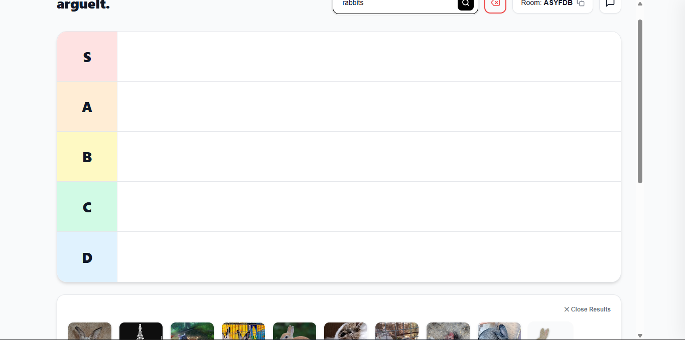

#argueIt
A real-time, multi-user tier-list maker featuring live state synchronization, text chat, and peer-to-peer voice calling.

##Live demo: https://argueit.duckdns.org/

##Description
argueIt is a multiplayer web application built to let users debate, rank, and organize items into tier lists together in real-time. The application utilizes a lightweight Java Javalin backend paired with a vanilla HTML, CSS and JavaScript frontend. It leverages WebSockets to instantly synchronize drag-and-drop item movements, remote user cursors, and text chat across all clients in a given room. To facilitate live debates, argueIt integrates WebRTC for seamless peer-to-peer voice communication directly in the browser. Users can populate their tier lists by pasting image URLs, pasting images directly from their clipboard, or making use of the integrated Wikipedia image search API. All room data and tier list states are persisted using a local SQLite database.

##Using the Live App
You do not need to install anything to use argueIt
1. Navigate to https://argueit.duckdns.org/ in any modern web browser
2. Enter a username and click "Create New Room" to generate a unique 6-character room code, or join an existing room using a shared code.
3. Use the unified input bar to search for images or paste URLs, drag them onto the tiers, and click the phone icon to join the voice call.

##Local Development and hosting
If you want to run the server locally or modify the code, follow these steps

###Dependencies
-Java Development Kit(JDK): Version 11 or higher is required to run the backend server
-Libraries: Javalin (Web framework), Gson (JSON parsing), and SQLite-JDBC (Database connectivity).
-Browser: A modern web browser with support for WebSockets and WebRTC(like chrome, firefox and edge).
-OS: Windows, Linux, macOS

###Installing
1. Clone or download the project repository to your local machine
2. Ensure your Java project is set up with a build tool like Maven or Gradle to manage the Javalin, Gson and SQLite dependencies
3. Place the frontend files(index.html, style.css, script.js) into the src/main/resources/frontend/ directory so they can be served correctly by Javalin.

##Executing Program
###How to run the program
1. Compile and build the project using your IDE or via the command line using your build tool
2. Run the App.javs main class to start the Javalin server and initialize the SQLite database
3. Open your web browser and navigate to the local server address

###Example Maven run command (if applicable to your setup)
mvn clean compile exec:java -Dexec.mainClass="com.argueit.App"

1. Navigate to http://localhost:8080 in your browser
2. Enter sa username and click "Create New Room" to generate a unique 6-character room code, or join an existing room using a shared code
3. Use the unified input bar to search for images or paste URLs, drag them onto the tiers, and click the phone icon to join the voice call

##Help and License
###Help
- Microphone Denied/Blocked: WebRTC requires a secure context to access the microphone. If you are hosting this yourself, ensure you are accessing the application via localhost or a secure https:// connection (the live demo at https://argueit.duckdns.org/ already handles this securely).
- Ghost Items/Desync: If the board appears out of sync, refreshing the page will trigger a "request_sync" event, fetching the latest accurate state directly from the SQLite database
- Database Cleanup: The server runs an automated background reaper task that deletes inactive rooms and their associated items after 24 hours to save space

###License
This project is licensed under the MIT License
Copyright © 2026 Oluwajubeelo Lawal.